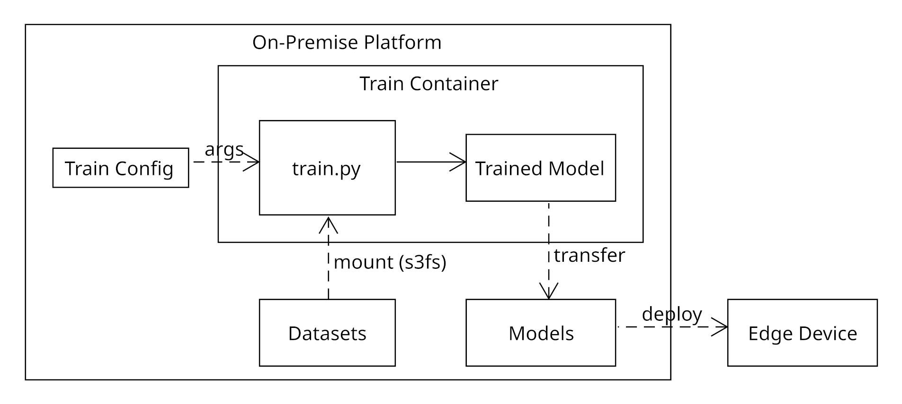

<!--
SPDX-FileCopyrightText: 2024 Osnabrück University of Applied Sciences
SPDX-FileContributor: Andreas Schliebitz

SPDX-License-Identifier: MIT
-->

# Train Container Template

**Author**: Andreas Schliebitz

**Organization**: Osnabrück University of Applied Sciences

**Published**: 2022-12-20

**Latest revision**: 2024-02-21

**Changelog**:

* 2023-01-03: Packaged Train Container Templates can now be uploaded directly into an instance of the On-Premise Platform.
* 2023-01-15: Error message about "S3 server did not return S3 credentials for given OIDC access token" can be ignored in development.
* 2023-02-20: Datasets not in CVAT XML format can be converted using the [`fiftyone`](https://docs.voxel51.com/recipes/convert_datasets.html#The-fiftyone-convert-command) Python library.
* 2023-02-27: In addition to the fully featured `fiftyone` library, a subset of tested label file conversions are offered by the On-Premise Platform through the Datasets page.
* 2023-02-28: After uploading a Train Container Template as a packaged ZIP archive to the On-Premise Platform, its directory structure and source files are checked against the schema files present in the [validation](./validation) directory.
* 2023-06-08: Following user feedback, the Getting Started Guide has been moved from the end of this document to the beginning.
* 2023-08-03: Making `cvat_dataset.py` idempotent by deleting already existing sample symlinks causing an error when using `docker start` instead of `docker run`.
* 2023-08-04: Adding support for customizing Train Container environment using `.env` file which is sourced by the `Dockerfile`'s `ENTRYPOINT`.
* 2023-08-31: Refactoring of the directory structure.
* 2023-10-06: Adding support for ONNX model export via [export.py](./export/export.py) using the [onnxmltools](https://github.com/onnx/onnxmltools) library.
* 2023-11-29: Documenting ONNX model export.
* 2024-02-21: Fixing warning emitted by `mv` trying to move `.` and `..` directories in `package.sh`.

## Table of Contents

1. [Introduction](#introduction)
2. [Getting started](#getting-started)
   1. [Environment](#environment)
   2. [Configuration](#configuration)
   3. [Setup](#setup)
   4. [Train](#train)
   5. [Build](#build)
   6. [Run](#run)
   7. [Upload](#upload)
3. [How it works](#how-it-works)
   1. [Datasets](#datasets)
      1. [Mounting](#mounting)
      2. [Splitting](#splitting)
   2. [Configuration Files](#configuration-files)
   3. [Training](#training)
   4. [ONNX Export](#onnx-export)
   5. [Dockerfile](#dockerfile)
   6. [GPU support](#gpu-support)
4. [Structural overview](#structural-overview)
   1. [Platform](#platform)
      1. [MinIO](#minio)
      2. [Backend](#backend)
   2. [Train Container](#train-container)

## Introduction

This repository provides a template for creating Docker Images compatible with the model training interface of the Agri-Gaia On-Premise Platform.

These instructions assume that a dataset has already been uploaded to the Platform together with an [`annotations.xml`](https://opencv.github.io/cvat/docs/manual/advanced/xml_format/) file or was annotated using the Platform's own CVAT instance. Follow this tutorial if you would like to train your own AI model in the Platform using an already uploaded dataset.

## Getting started

This getting started guide assumes that you'll be developing your Train Container on a Debian based operating system. If your system differs significantly from a standard Debian/Ubuntu installation some `apt` packages (or even the package manager itself) might be available under a different name.

This guide was tested on `Ubuntu 22.04.1 LTS x86_64` with Linux Kernel `5.15.0-47-generic` and `docker 20.10.12-0ubuntu4`.

### Environment

1. Install Docker and add your user to the `docker` group:

   ```bash
   sudo apt update \
       && sudo apt install --no-install-recommends -y docker.io zip \
       && sudo usermod -aG docker "${USER}" \
       && sudo systemctl restart docker \
       && sudo systemctl enable docker
   ```

   Now login and logout for your user to become a recognized member of the `docker` group.

   **Optional**: If you would like to enable GPU access for your Train Container on your system, install `nvidia-container-toolkit` as described in [GPU Support](#gpu-support).

2. **Optional**: If you would like to base your Train Container on the official NVIDIA Docker Images, you'll have to create an [NVIDIA Developer account](https://developer.nvidia.com/login) in order to access their registry.

   * After registration, [login](https://ngc.nvidia.com/signin) and navigate to the [API key panel](https://ngc.nvidia.com/setup/api-key) and create an API key by clicking `Generate API Key`.

   * In order to fetch images from NVIDIA's Docker registry, your local Docker client will have to authenticate itself (i. e. [`login`](https://docs.docker.com/engine/reference/commandline/login/)) using your API key as a pull secret:

      ```bash
      docker login --username '$oauthtoken' --password '<Your API key>' nvcr.io
      ```

3. **Optional**: If your dataset labels are not in the CVAT XML format, visit the On-Premise Platform's Datasets page to perform appropriate label file conversions. As this functionality is implemented using the [`fiftyone`](https://docs.voxel51.com/recipes/convert_datasets.html#The-fiftyone-convert-command) Python library, you may also use their `fiftyone convert` command line utility:

   ```bash
   virtualenv venv && source venv/bin/activate
   pip install --upgrade pip \
      && pip install fiftyone pycocotools
   ```

   The following code snipped converts a COCO detection dataset into a CVAT image dataset:

   ```bash
   # Convert a COCO detection dataset to CVAT image format
   fiftyone convert \
      --input-dir /path/to/coco-detection-dataset \
      --input-type fiftyone.types.COCODetectionDataset \
      --output-dir /path/for/cvat-image-dataset \
      --output-type fiftyone.types.CVATImageDataset
   ```

   Please keep in mind that _label only_ conversions between some label formats are impossible. For example, a conversion from YOLOv5 to COCO is not possible without the actual images, because the YOLOv5 format does not include information about the image resolution, whereas COCO does. Likewise, some conversions may lead to unexpected results due to non-automatic or lossy mappings of some input to output label fields. The subset of conversions offered by the On-Premise Platform tries to avoid these issues by combining `fiftyone`'s core functionality with additional transformations depending on the selected input and output formats.

4. Clone this repository into a directory called `train-container`:

   ```bash
   # Using SSH
   git clone git@github.com:agri-gaia/train-container-template.git train-container

   # Or using HTTPS
   git clone https://github.com/agri-gaia/train-container-template.git train-container
   ```

5. Create a local development environment resembling the temporary build directory created inside the Platform. To achieve this, copy all the files from this repository into a new sibling directory called `dev/`:

   ```bash
   mkdir -p dev/ \
       && cd train-container/ \
       && find common/ -type f -exec cp {} ../dev \; \
       && find datasets/ -type f -exec cp {} ../dev \; \
       && find export/ -type f -exec cp {} ../dev \; \
       && find templates/provider/ -type f -exec cp {} ../dev \; \
       && cd ../dev
   ```

6. Add all Python packages required for running `setup.py` and  `train.py` to `requirements.txt`. It is recommended that you pin each requirement to a specific version number as illustrated below with the `opencv-python` package:

   ```text
   # This will always pull the latest version of OpenCV at build time.
   opencv-python

   # Instead, specify the exact version number of the dependency.
   opencv-python==4.5.5.64
   ```

7. **Optional**: Configure additional environment variables which will be visible inside the Train Container by adding `ENV_VAR=value` entries to the [`.env`](./templates/provider/category/architecture/docker/.env) file. **Do not** add `DATASET_ID=<id>` to this file manually as this will overwrite the `-e DATASET_ID=<id>` set by `docker run`. Environment variables inside `.env` are assumed to be static and therefore not editable by the user. The Platform's backend uses `.env` to change the dataset of an already build Train Container if requested by the user through the Model Training UI. This is due to `docker start`'s [inability](https://github.com/moby/moby/issues/7561) to change the container environment after it has been set by `docker run`.

8. Inside your `dev/` directory, create a local `./minio` directory containing your dataset samples and `annotations.xml` as shown in [MinIO](#minio):

   ```bash
   mkdir -p minio/datasets/1/annotations
   ```

   In this step you're essentially mocking the Platform's MinIO instance which of course is not setup and running on your local system. This directory is later mounted as a Docker volume into your Train Container to simulate a dataset mounted through `s3fs`.

   **Important**: Do not forget to actually copy your samples and the `annotations.xml` into this directory structure before running the container.

9. Test your development environment by [building](#build) and [running](#run) a Train Container with the default scripts and configuration files. If you see the following output printed to your terminal, you are ready to go:

   ```text
   Executing your training code in train.py::__main__
   ```

### Configuration

1. Edit `config.jsonschema` to include all the user editable configuration options which will be provided as command line arguments to your `train.py` script.

   The `config.jsonschema` will only be used by the Platform's frontend to render the configuration form in the Model Training UI. Therefore, in development, you'll have to mock the actual instantiation of your JSON-Schema (contents of the form) by editing `train_config.json`.

2. Edit `presets.json` to contain preset configuration options for your `train.py` script. The attributes in `presets.json` will be merged into `train_config.json` by calling `finalize_config` in `setup.py`.

3. Edit `custom.json` to contain the full output filepath of the trained model (`model_filepath`), a regular expression (`score_regexp`) for extracting the model's score on the test dataset from the container logs and the abbreviation of the score's name (`score_name`).

4. **Optional**: If you want to use the ONNX model export functionality, edit `export_config.json` to include the correct configuration options like the `model_type`, `input_shapes`, `output_shapes` and `input_types`.

5. Edit `args.py` to reflect all the attributes present in `presets.json` and `train_config.json`. Leaving out any attribute will produce an error because `config_to_args.py` will then try to pass command line arguments to `train.py` which are not defined in `args.py`.

Before [uploading](#upload) your Train Container into a Platform instance, make sure that your final `config.jsonschema` and `train_config.json` are compatible, `presets.json` is updated to the latest version and `args.py` contains all attributes present in `train_config.json` and `presets.json`.

### Setup

The provided `setup.py` script contains example code for loading and splitting a CVAT classification dataset from the `/minio` mount. It also parses `annotations.xml` and outputs `labels.json` files in COCO format.

Although `setup.py` can be customized to a very high degree, the following steps should be adhered to:

1. Load the contents of `train_config.json` into a Python dictionary called `config`.

   * This dictionary contains the user defined percentages for splitting the dataset into train and test splits.

2. Load the sample paths from `/minio/datasets/1` and associate them with their labels from `annotations.xml`.

   * Please note that for building the dataset's path, you should use `os.getenv('DATASET_ID')` inside the container to access the dataset's ID.

3. Split the samples together with their labels into a train and test split.

4. Create the required directory structure inside of  `/datasets`.

5. Create and store the label files in their appropriate split directory in `/datasets/labels`.

6. Symlink the dataset samples from `/minio/datasets/1` into their appropriate split directory in `/datasets/images`.

7. Call `finalize_config(config)` to extend `train_config.json` with the contents of `presets.json`.

### Train

The `train.py` script is the entrypoint for the model training. It uses `args.py` to receive the command line arguments passed to it by `config_to_args.py`.  Since `train.py` can contain very specific code, the provided source file is more or less empty. However, the following exemplary training and evaluation steps might help you structure your own implementation:

1. Download some pretrained weights from a server (FTP, HTTP, ...).

2. Load the train/test image and label data from `ARGS.images_dir` and `ARGS.labels_dir`.

3. Initialize the architecture (e. g. neural network) with pretrained weights and adjust the network's output layer to match your dataset (Transfer Learning).

   * **Hint**: There is usually no need to pass metadata about your dataset (like `num_classes`) as command line arguments to `train.py`. Most information should be contained in your label files (like COCO's `labels.json`) which can be extracted at runtime.

4. Configure your train and test loops. Implement them by taking arguments like `ARGS.epochs` and `ARGS.batch_size` into account. You might also want to implement a learning rate scheduler and parameterize an optimizer.

5. Train the model on the train split and print train metrics (like `train_loss`)  to `stdout`.

6. Test the model on the test split and print the test metrics to `stdout`.

   * If you are outputting multiple metrics like `precision`, `recall` and `F1score`, make sure that your `score_regexp` defined in `custom.json` matches at least one of them, preferably the most representative (`F1score`).

7. Store the trained model as a file in `ARGS.output_dir` by either calling your implementation of some `save_model` function or attempting an [ONNX export](#onnx-export) using `export_model` from `export.py` in conjunction with the configuration values from `export_config.json`. The Platform currently supports the following model formats:

   * **PyTorch**: `.pt, .pth, .torchscript`

   * **ONNX**: `.onnx`

   * **TensorRT**: `.plan`

   * **TensorFlow**: `.graphdef`

Conversions to ONNX are currently only supported from PyTorch, Keras and TensorFlow model formats.

### Build

To build and tag your Train Container run the following command inside your `dev/` directory:

```bash
DOCKER_BUILDKIT=1 docker build -t my-train-container .
```

Note that `.` marks the directory of the `Dockerfile` and is therefore also the build context. You may replace `my-train-container` with the actual name of your Train Container. If you notice that some changes did not get applied to the image on rebuild, run the [`build`](https://docs.docker.com/engine/reference/commandline/build/) command with the `--no-cache` flag.

### Run

To run your Train Container execute the following command inside your `dev/` directory:

```bash
docker run --rm \
    --gpus '"device=0"' \
    --ipc host \
    --shm-size=8GB \
    --ulimit memlock=-1 \
    --ulimit stack=67108864 \
    --name=my-train-container \
    -e NVIDIA_VISIBLE_DEVICES="0" \
    -e DATASET_ID=1 \
    -v "$(pwd)/minio":/minio \
    -v "$(pwd)/train":/train \
    my-train-container
```

Only specify `--gpus` and `-e NVIDIA_VISIBLE_DEVICES` if you have `nvidia-container-toolkit` installed on your development system. If your container runs out of shared memory while loading the dataset, increase `--shm-size` to an appropriate value.

After termination, the container will remove itself from the system through the use of `--rm` (_remove_). This is usually a good idea if you are developing iteratively and in the process want to preserve hard disk space. Just make sure to persist important data created inside the container by using (additional) volume mounts:

```bash
-v "$(pwd)/inside/dev":/path/in/container
```

The [`run`](https://docs.docker.com/engine/reference/commandline/run/) command shown above contains two predefined volume mounts. The first one is for mounting your dataset samples into your mocked `s3fs` mount and the other is for storing the trained model file. These two mount points are also shown in the [Train Container's](#train-container) directory structure.

In development, you can safely ignore the following error message as your dataset is being mounted locally into your Container and therefore not read from an actual S3 storage.

```text
Error: S3 server '' did not return S3 credentials for given OIDC access token.
```

### Upload

A Train Container Template can be automatically integrated into an instance of the On-Premise Platform. For this to work, you'll have to package and upload your custom Train Container Template as a ZIP archive using the Model Training UI. This is achieved through the following three-step process:

1. Making sure your Train Container is idempotent, meaning consecutive runs via `docker start` will not lead to any errors caused by changes to the Container's filesystem.

2. Transforming the contents of your `dev/` directory back into the structure of this repository. For this you should invoke the [`package.sh`](./package.sh) script _outside_ your `dev/` directory after changing `provider`, `category` and `architecture` to their appropriate values:

   ```bash
   cd .. && cp train-container/package.sh . \
      && ./package.sh "provider" "category" "architecture"
   ```

   The `package.sh` script produces a ZIP archive called `train-container-publish.zip` next to your `dev/` directory containing the project files in the directory structure required by the Platform's backend.

3. Upload this archive into the Platform using the Train Container Template Upload functionality accessible through the Model Training UI.


## How it works

The most abstract overview of how model training works in the Platform can be given by the following diagram:



The user should already be familiar with the `Datasets` and `Models` pages of the On-Premise Platform which are essentially the start and end point of a model training cycle. After visiting the Model Training UI, the user has to select an already existing dataset from `Datasets` and create a training configuration (`Train Config`) via the displayed form or JSON editor. In the backend, information about the selected dataset and the user defined train configuration are passed as inputs to the Train Container which:

1. Mounts the user's dataset from MinIO via [`mount-s3.sh`](./common/mount-s3.sh).

2. Creates the matching labels for the dataset by parsing `annotations.xml`.

3. Splits the dataset and labels into train and test splits using symbolic links (_symlinks_) into the mounted MinIO bucket.

4. Executes [`train.py`](./templates/provider/category/architecture/docker/train.py) which reads the dataset splits through their symlinks in a just in time fashion, executes the training code and initiates evaluation of the model after training has finished.

The following sections describe the abstract flow of dataset mounting and splitting, the contents and purpose of the different configuration files as well as the required project structure for training AI models using the **Agri-Gaia Model Training Template**.

### Datasets

#### Mounting

The user selected dataset is automatically made available inside the Train Container after the training cycle has started. To achieve this, we use [`s3fs-fuse`](https://github.com/s3fs-fuse/s3fs-fuse) to logically bind the user's S3 bucket from MinIO into the `/minio` directory inside the container. The user is authenticated through the Platform's backend via his personal OAuth Token and MinIO's [Security Token Service (STS)](https://min.io/docs/minio/linux/developers/security-token-service.html) using the [AssumeRoleWithWebIdentity](https://min.io/docs/minio/linux/developers/security-token-service/AssumeRoleWithWebIdentity.html) API endpoint (see [`mount-s3.sh`](./mount-s3.sh)).

Please note that after this operation, `/minio/datasets` contains _all_ the user's datasets. This is the case because `s3fs` can only mount entire buckets and not individual subdirectories. These datasets are **not copied** into the container but rather loaded just in time over the network when accessed by the Train Container. The specific dataset is selected via the `DATASET_ID` environment variable (see [`dataset.py`](./common/dataset.py)) provided to the Train Container by the backend. The backend is essentially executing `docker run` on the Train Container with `-e DATASET_ID=<id>`.

#### Splitting

Inside the running container all dataset samples are collected from `/minio/datasets/<id>` using `*.*` as `glob` expression. This works under the assumption that each **regular non-hidden file** (e. g. `1.jpg`, `2.png`, `3.bmp`, ...) inside that directory is a sample. Everything else, like the `annotations` subdirectory, is ignored.

Before the actual splitting of the dataset, each sample has to be associated with its label. Due to the Platform's requirement that the labels must be provided in the CVAT annotation format, the current implementation in [`cvat_dataset.py`](./datasets/cvat_dataset.py) expects the `annotations.xml` to be present in `/minio/datasets/<id>/annotations/annotations.xml`. An image sample is matched to its annotations based on its filename (`1.jpg`) and the _filename_ of the `name` attribute of the `<image>` tag inside the dataset's `annotations.xml`:

```xml
...
<image id="1" name="aschlieb/55/1.jpg" width="1200" height="800">
    <box label="green" occluded="0" source="manual" xtl="0.00" ytl="67.85" xbr="141.84" ybr="239.27" z_order="0">
    </box>
    ...
</image>
...
```

For a dataset annotated in the Platform's CVAT instance, this annotation file is automatically exported and updated in the user's MinIO bucket upon start of training.

Splitting the dataset into train and test splits is implemented using Scikit-learn's [`model_selection.train_test_split`](https://scikit-learn.org/stable/modules/generated/sklearn.model_selection.train_test_split.html) where `test_size` and `train_size` are user defined percentage values from [`train_config.json`](./templates/provider/category/architecture/config/train_config.json). Therefore, the fields `train-split` and `test-split` should be present in your [`config.jsonschema`](./templates/provider/category/architecture/config/config.jsonschema).

In the case of `cvat_dataset.py` the images (samples) from `/minio/datasets/<id>` are symlinked into the directory `/datasets/images` which contains two subdirectories `train/` and `val/` for the training and test data respectively. Depending on the data loaders of your training scripts, the CVAT labels can be transformed into the COCO ([spec](https://cocodataset.org/#format-data)) or YOLO ([spec](https://github.com/ultralytics/yolov5/wiki/Train-Custom-Data#12-create-labels-1)) format (see `as_yolo` and `as_coco` in `cvat_dataset.py`). For CVAT datasets, the labels will then be written into `/datasets/labels/{train, val}` using the appropriate format (`*.json` for COCO, `*.txt` for YOLO).

### Configuration Files

The template for [rendering the configuration form](https://github.com/rjsf-team/react-jsonschema-form) of a given architecture, including value constraints and descriptions, is based on a `config.jsonschema` ([spec](https://json-schema.org/specification.html)) file which is fetched from the backend. After editing and submitting the configuration form in the frontend, its JSON contents are written to `train_config.json` and merged with [`presets.json`](./templates/provider/category/architecture/config/train_config.json) in the backend. Finally, a single configuration file `train_config.json` is created and converted into long style command line arguments (`--example-arg`) by [`config_to_args.py`](./config_to_args.py). These arguments are then passed to `train.py` inside the container.

* [`presets.json`](./templates/provider/category/architecture/config/presets.json): Contains additional configuration options which should not be editable by the user through the frontend. These are also passed as command line arguments to `train.py`. Mandatory fields are `output-dir` as the output path of the trained model as well as `images-dir` and `labels-dir` as the input paths for images and labels respectively. **Changing these paths with CVAT datasets is not necessary.**

  ```json
  {
    "output-dir": "/train",
    "images-dir": "/datasets/images",
    "labels-dir": "/datasets/labels"
  }
  ```

* [`custom.json`](./templates/provider/category/architecture/config/custom.json): Contains only mandatory non-training configuration options required by the Platform's backend to locate the trained model inside the container (`model_filepath`) and extract a training metric (`score_name`) from the container logs using a regular expression (`score_regexp`). These options are **not** passed to `train.py`.

  ```json
  {
    "model_filepath": "/train/model.pt",
    "score_name": "Acc.",
    "score_regexp": "[ ]+Accuracy[ ]+(\\d*[.]\\d*)\\n"
  }
  ```

  As you can see, the trained `model.pt` has to be located inside the `output-dir` directory specified in `presets.json`. The `model_filepath` is required, because third party containers or model training SDKs might use different naming conventions for outputting trained models (e. g. `best.pt` or `latest.pt` instead of `model.pt`).

  Please note, that `score_regexp` has to be a [`re`](https://docs.python.org/3.11/library/re.html#module-re) compatible expression where the first capture group has to match the model's score value in the container logs. In the example above, we capture the model's `Accuracy` on the test split as a floating point value from the following log output:

  ```text
  ───────────────────────────────────────────────────
         Test metric             DataLoader 0
  ───────────────────────────────────────────────────
          Accuracy            0.29411765933036804
  ```

  The score value is then rounded to three decimal places by the backend before being displayed to the user in the frontend through the Model Training UI.

* [`train_config.json`](./templates/provider/category/architecture/config/train_config.json): This file is an instantiation of `config.jsonschema` containing the same keys but with actual user defined values. The contents of this configuration file are created in the frontend by modifying the form in the Model Training UI. The backend receives this configuration data as a plain JSON object and writes it as `train_config.json` into the Train Container's temporary build directory where it is extended by the contents of `presets.json`. At this point, `train_config.json` contains _all_ the key-value attributes which will be passed as command line arguments to `train.py` by `config_to_args.py`.

### Training

As required by [`docker-entrypoint.sh`](./common/docker-entrypoint.sh) you'll have to provide the following two _essential_ Python scripts for the Train Container to start:

* [`setup.py`](./templates/provider/category/architecture/docker/setup.py): In the case of CVAT datasets, this file depends heavily on the functionality provided by `cvat_dataset.py`. It loads and splits the dataset using `get_cvat_dataset`, creates the required directories in `/datasets` and writes the sample symlinks and label files into their appropriate subdirectories. There is only one mandatory requirements for implementing `setup.py` which is calling `finalize_config` at the end of `__main__` in order to create `train_config.json`. Otherwise you'll just have to make sure that the dataset and its labels from `/minio/datasets/<id>` are correctly split/transformed and in the right location before executing `train.py`.

* [`train.py`](./templates/provider/category/architecture/docker/train.py): A custom training script which uses the [`argparse`](https://docs.python.org/3/library/argparse.html) module to process the command line arguments passed to it by `config_to_args.py` (see [`args.py`](./templates/provider/category/architecture/docker/args.py)). The main purpose of this script is to:

  1. Train an AI model using the data and labels from `--images-dir` and `--labels-dir` (see `presets.json`).

  2. Calculate and print a performance metric for the trained model on the test split.

  3. Output the trained model as a file into `--output-dir` with a filename matching `model_filepath` from `custom.json`.

How the data is loaded, the model trained and evaluated is completely implementation dependent and customizable via command line arguments.

In addition to the Python dependencies already installed in the base image (see [`Dockerfile`](./templates/provider/category/architecture/docker/Dockerfile)), custom dependencies required by `setup.py` or `train.py` can be added to the [`requirements.txt`](./templates/provider/category/architecture/docker/requirements.txt) file. These libraries will be downloaded and installed inside the train image at build time.

### ONNX Export

Once the model training has been completed, the platform enables the user to convert the created PyTorch, Tensorflow or Keras model into the ONNX format. For this, we implement the conversion interfaces provided by the [`onnxmltools`](https://github.com/onnx/onnxmltools) library. The user interacts with these interfaces by providing an instantiation of the [`export.jsonschema`](./export/export.jsonschema) by filling out the "ONNX Export Configuration" form through the Platform's Model Training UI. After the form inputs are sent to the backend, they are then stored in the Train Container's temporary build context as [`export_config.json`](./export/export_config.json). Upon build, this file is copied into the image via the [`Dockerfile`](./templates/provider/category/architecture/docker/Dockerfile) of the respective Train Container template.

The logic behind exporting trained AI models to ONNX is encapsulated in the [`export.py`](./export/export.py) source file. As outlined in [`train.py`](./templates/provider/category/architecture/docker/train.py), the user has two choices for saving the trained model to a file:

1. Provide your own implementation of some `save_model` function that writes `model` to `model_filepath` inside the container.
2. Use the predefined `export_model` function from `export.py` which will attempt an ONNX model export using the user defined configuration values from `export_config.json`:

   ```python
   from export import export_model

   export_model(
      model=trained_model,
      model_filepath=model_filepath,
      model_format="pytorch",
      default_model_export_func=save_model,
   )
   ```

   In the example above, `export_model` will execute your (tested) implementation of `save_model`, should the ONNX conversion fail for any reason. In that case, `save_model` will receive `model` and `model_filepath` as parameters.

### Dockerfile

We provide a [`Dockerfile`](./templates/provider/category/architecture/docker/Dockerfile) (base image template) for building custom Train Containers which integrate seamlessly into the Platform's Model Training backend. In order to support hardware accelerated training on NVIDIA graphics cards (GPUs), it's highly recommended to use one of the official [NVIDIA base images](https://catalog.ngc.nvidia.com/containers) like the one for PyTorch:

```dockerfile
# Official NVIDIA PyTorch base image
FROM nvcr.io/nvidia/pytorch:22.08-py3
```

As you might have noticed, every `COPY` instruction inside the `Dockerfile` assumes the build context to be the same as the `Dockerfile`'s directory. This is usually only the case in the Platform's backend, where all the required files, including the `Dockerfile` itself, are copied into a temporary build directory. For local development purposes, you would need to be perform this step manually in accordance to the `COPY` instructions in the `Dockerfile`.

The commands above `WORKDIR /workspace` should not be deleted or changed. However, they might be _extended_ by installing additional `apt` packages or adding `RUN` commands for user specific image configuration.

In the top level directory of this repository, we also provide Python helper script like `cvat_dataset.py` which you are free to use in your custom image. We would encourage you not to change `docker-entrypoint.sh` and adhere to the two-stage execution of `setup.py` followed by `train.py`. Especially messing with the contents of `mount-s3.sh` and its invocation in `docker-entrypoint.sh` will likely cause issues in mounting datasets from the Platform into your container.

For building and running a Train Container in development, see the section about [getting started](#getting-started).

### GPU support

Train images are built and stored in the On-Premise Platform's own Docker registry. When an image is executed for the first time via the Model Training UI, a Docker Container is created and transferred from the Platform's registry to the Platform's host machine for execution. This transfer may take some time at first but after that, execution of the Train Container will be instantaneous. This transfer is necessary to access the host's GPU resources and decouple training from the Platform.

On deployment, NVIDIA GPU support for Docker Containers will be automatically installed on the host machine in the form of [`nvidia-container-toolkit`]( https://docs.nvidia.com/datacenter/cloud-native/container-toolkit/latest/install-guide.html). This feature will only be available if at least one NVIDIA GPU is detected on the host during deployment. You can install `nvidia-container-toolkit` on your local Ubuntu development system using the following commands:

```bash
sudo apt-get update \
  && sudo apt-get install --no-install-recommends -y \
    apt-transport-https ca-certificates \
    curl gnupg-agent software-properties-common
```

```bash
curl -fsSL https://nvidia.github.io/libnvidia-container/gpgkey \
    | sudo gpg --dearmor -o /usr/share/keyrings/nvidia-container-toolkit-keyring.gpg \
    && curl -s -L https://nvidia.github.io/libnvidia-container/stable/deb/nvidia-container-toolkit.list \
    | sed 's#deb https://#deb [signed-by=/usr/share/keyrings/nvidia-container-toolkit-keyring.gpg] https://#g' \
    | sudo tee /etc/apt/sources.list.d/nvidia-container-toolkit.list \
    && sudo apt-get update \
    && sudo apt-get install --no-install-recommends -y nvidia-container-toolkit
```

```bash
sudo nvidia-ctk runtime configure --runtime=docker
```

## Structural overview

This section aims at giving an overview and brief explanation of the directory structures present in the Platform and the Train Container.

### Platform

For developing a Platform compatible Train Container we should be aware of the directory structure present in a user's MinIO S3 bucket and the backend. The Platform's backend is especially important as it stores all custom Train Container configurations and source files in a specific folder hierarchy.

#### MinIO

Each registered user with username `username` owns exactly one MinIO bucket. A bucket can be logically subdivided into nested directories. Datasets are always uploaded into a user's `datasets/` bucket into a subdirectory which name is the dataset's numeric ID (`1/`). In the Train Container the entire `datasets/` directory will be accessible through `/minio/datasets`. Inside each numeric subdirectory the Train Container will be able to access the dataset samples as regular files (`1.jpg`, `2.jpg`, ...). Additionally, CVAT annotations may be present in `annotations/` as an `annotations.xml` file. This is only the case if the user has uploaded this file together with the dataset or annotated the dataset using the Platform's CVAT instance.

```text
username/
└── datasets/
    └── 1/
        ├── 1.jpg
        ├── 2.jpg
        ├── 3.jpg
        ├── 4.jpg
        └── annotations/
            └── annotations.xml
```

#### Backend

In the Platform's backend there exists a directory `model-training/` which is synonymous with the root of this repository. The backend expects the artifacts of a Train Container to be grouped in nested directories inside `model-training/` as follows:

1. Name of provider ([`provider/`](./templates/provider)): Which organization provides the model architecture and or source files for training? In the example below the implementation of the `EfficientNet` classifier is provided by `Torchvision`.

2. Category of model ([`category/`](./templates/provider/category)): What is the trained model's problem domain? Looking at the example below, `EfficientNet` is an image classifier hence the `category/` directory is renamed to `Classification`.

3. Name of architecture ([`architecture/`](./templates/provider/category/architecture)): What is the name of the neural network architecture or method used for training the model inside the Train Container? The example below uses the `EfficientNet` architecture.

```text
model-training/
├── common
│   ├── config.py
│   ├── config_to_args.py
│   ├── dataset.py
│   ├── docker-entrypoint.sh
│   └── mount-s3.sh
├── datasets
│   └── cvat_dataset.py
├── export
│   ├── export.jsonschema
│   └── export.py
├── templates
│   └── Torchvision
│      └── Classification
│         └── EfficientNet
│             ├── config
│             │   ├── config.jsonschema
│             │   ├── custom.json
│             │   └── presets.json
│             └── docker
│                 ├── args.py
│                 ├── Dockerfile
│                 ├── efficientnet_datamodule.py
│                 ├── efficientnet_dataset.py
│                 ├── efficientnet.py
│                 ├── requirements.txt
│                 ├── setup.py
│                 ├── train.py
|                 ├── util.py
│                 └── .env
└── validation
    ├── common.json
    └── template.json
```

Inside the `architecture/` directory all the configuration files have to be located inside the `config/` directory. Train Container specific files like the `Dockerfile` as well as the `setup.py`, `train.py` and `requirements.txt` files have to be placed in a directory called `docker/`.

### Train Container

The following directory tree of the Train Container illustrates:

* `/minio/datasets`: The `s3fs` mounted dataset of the user's MinIO S3 bucket.

* `/datasets`: The user's dataset separated into train and test datasets (50:50) as well as the  train and test labels for each sample in COCO format generated by parsing `annotations.xml` and applying `as_coco` from `cvat_dataset.py`.

* `/docker-entrypoint.sh`: The Train Containers entrypoint script which is called in the `Dockerfile`.

* `/workspace`: The location of any other source or configuration file. This makes sure that `setup.py` and `train.py` are able to find any non-module dependencies without the actual need to install your source files as a standalone Python module.

* `/train`: Output directory of the trained model as defined in `presets.json`.

```text
/
├── datasets/
│   ├── images/
│   │   ├── train/
│   │   │   ├── 1.jpg -> /minio/datasets/1/1.jpg
│   │   │   └── 2.jpg -> /minio/datasets/1/2.jpg
│   │   └── val/
│   │       ├── 3.jpg -> /minio/datasets/1/3.jpg
│   │       └── 4.jpg -> /minio/datasets/1/4.jpg
│   └── labels/
│       ├── train/
│       │   └── labels.json
│       └── val/
│           └── labels.json
├── docker-entrypoint.sh
├── minio/
│   └── datasets/
│       └── 1/
│           ├── 1.jpg
│           ├── 2.jpg
│           ├── 3.jpg
│           ├── 4.jpg
│           └── annotations/
│               └── annotations.xml
├── mount-s3.sh
├── train/
│   └── model.pt
└── workspace/
    ├── args.py
    ├── config.py
    ├── config_to_args.py
    ├── cvat_dataset.py
    ├── dataset.py
    ├── presets.json
    ├── requirements.txt
    ├── setup.py
    ├── train_config.json
    ├── train.py
    ├── .env
    └── ...
```
